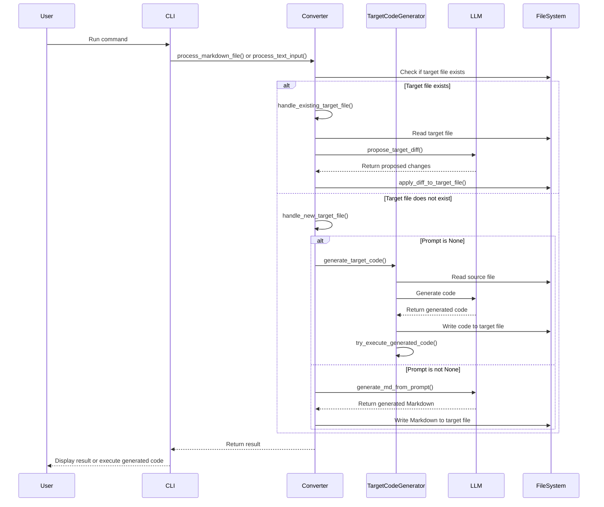
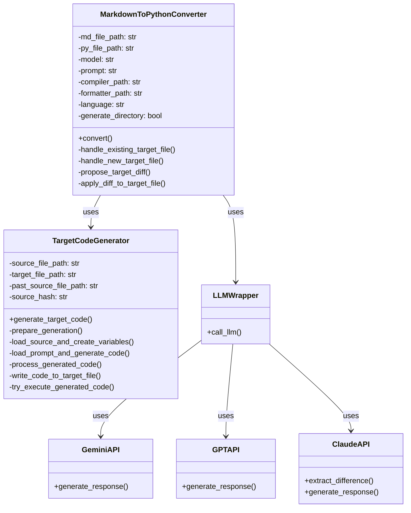

# Zoltraak ウェブアプリ向け改造内容

Zoltraak はあなたの創造性を引き出す「魔法」です。

より多くの人に使っていただくためにはコマンドラインではなくブラウザで使える必要性を感じていました。
ただし Zoltraak の根底にある思想とファイル構成をできるだけいじらずにアプリ化する必要もありました。

このページでは Zoltraak コアコードの変更点をまとめました。
また大規模言語モデル (LLM) を使ったアプリ開発をやりたい人向けに、生きた教材として使えるようにコードの関連図も用意しました。

## 主な変更点

1. Python コーティング規約 PEP8 準拠
    - `flake8` ライブラリで検証済
    - コメントを最小限に削減
2. 大規模言語モデル対応あれこれ
    - LLM 召喚関数の共通化
    - Claude, GPT, Gemini API をそれぞれ用意、原理的にモデル指定まで可能
    - 要件定義書ファイル名生成→俳句固定
    - 要件定義書中身生成→モデル選択可能
    - 要件定義書修正→俳句固定
    - コード生成 → Sonnet 3.5 固定
3. 実行中のキーボード入力を無効化
    - Enter キーを押さなくても実行継続
    - 差分修正処理の選択肢削除、AI適用のみ
4. 前項に伴いコマンドオプション追加
    - `-m maker/model` 要件定義書の中身生成モデルの指定
    - `-d` 要件定義書生成後、コード生成（領域展開）も実行する
5. 生成コードの VS codeでの表示を省略
6. プロンプト色変更書式を Streamlit マークダウン色変更書式に変更
7. 補助ファイルに調整
    - コード生成を安定化させるように architect を調整, Claude 3.5 Sonnet 用ファイルを別途用意
    - コンパイラを大幅追加

## 各コードの解説 generated by Claude 3.5 Sonnet

このプロジェクト構造は、マークダウンファイルをPythonコードに変換し、異なる言語モデルを使用してコード生成や応答生成を行う機能を提供しています。CLIインターフェース、コンバーター、各種LLM APIとの統合が含まれています。

### 1. gencode.py
- TargetCodeGenerator クラス
  - generate_target_code(): ソースファイルからターゲットファイルを生成
  - prepare_generation(): 生成の準備
  - load_source_and_create_variables(): ソースファイルの読み込みと変数作成
  - load_prompt_and_generate_code(): プロンプト読み込みとコード生成
  - process_generated_code(): 生成されたコードの処理
  - write_code_to_target_file(): コードをターゲットファイルに書き込み
  - try_execute_generated_code(): 生成されたコードの実行

### 2. cli.py
- main(): CLIのエントリーポイント
- process_markdown_file(): Markdownファイルの処理
- process_text_input(): テキスト入力の処理
- generate_md_file_name(): Markdown要件定義書ファイル名の生成

### 3. converter.py
- MarkdownToPythonConverter クラス
  - convert(): 変換プロセスの実行
  - handle_existing_target_file(): 既存のターゲットファイルの処理
  - handle_new_target_file(): 新しいターゲットファイルの処理
  - propose_target_diff(): ターゲットファイルの変更差分の提案
  - apply_diff_to_target_file(): 差分のターゲットファイルへの適用

### 4. llms/common.py
- call_llm(): 異なる言語モデル（LLM）の呼び出し

### 5. llms/gemini.py
- generate_response(): Google Gemini APIを使用した応答生成

### 6. llms/gpt.py
- generate_response(): OpenAI GPT APIを使用した応答生成

### 7. claude.py
- extract_difference(): Claude APIを使用した差分抽出
- generate_response(): Claude APIを使用した応答生成

### 8. settings.py
- 環境変数の読み込みと設定

## 各種図

### シーケンス図

### クラス図

