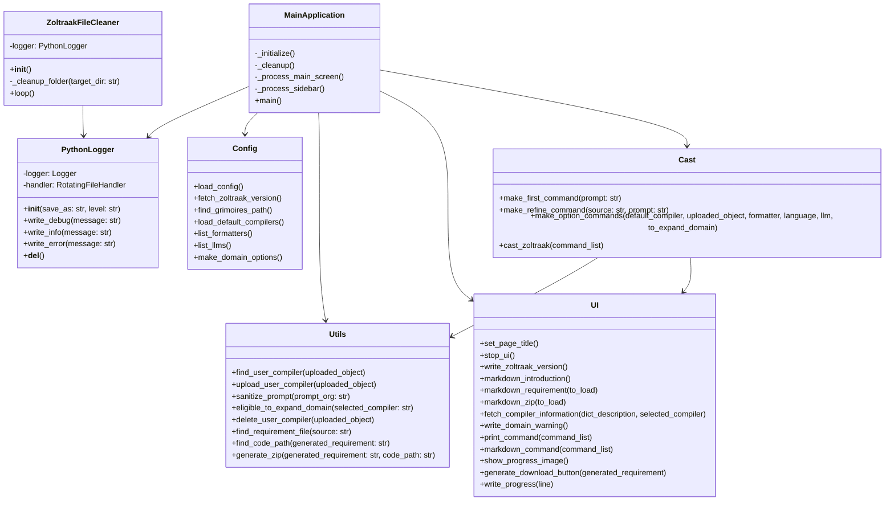
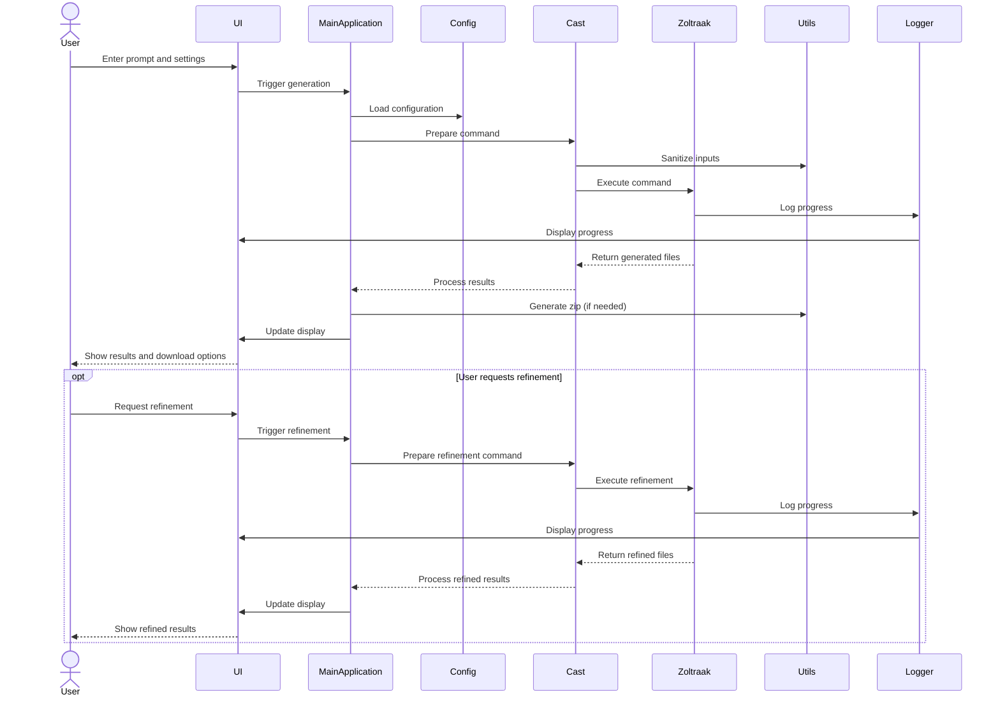

# Zoltraak ウェブアプリのコード解説

このページでは Python ファイルに基づいて Zoltraak ウェブアプリケーションの構造と機能の概要を示します。

## 概要

Zoltraak は、ユーザーのプロンプトに基づいて要件とコードを生成する Python ベースのアプリケーションのです。
Streamlit で構築された Web インターフェースを使用し、さまざまな AI モデルと対話してテキストを生成します。

## 主な機能
1. カスタム コンパイラの選択とアップロード
2. 複数の AI モデル (GPT, Claude, Gemini) から選択
3. ユーザー プロンプトに基づく要件定義書生成
4. コード生成（オプション）
5. 生成されたコンテンツのダウンロード オプション (Markdown および Zip)
6. 生成された要件定義の改良

## 主要コンポーネント

### 1. ユーザー インターフェース (ui.py)
- Streamlit ベースのユーザー インターフェースを処理します
- ページ レイアウト、ボタン、およびユーザー入力を管理します
- 生成された要件を表示し、ダウンロード オプションを提供します

### 2. 構成 (config.py)
- YAML ファイルから構成を読み込みます
- パス、コンパイラ情報、およびアプリケーション設定を管理します
- 使用可能なフォーマッタと LLM を一覧表示する関数を提供します

### 3. ユーティリティ関数 (utils.py)
- ファイル操作を処理します (パスの検索、zip ファイルの生成)
- ユーザー入力をサニタイズします
- ユーザーがアップロードしたコンパイラを管理します

### 4. ログ記録 (logger.py)
- ローテーション付きのカスタム ログ記録システムを実装します

### 5. メイン アプリケーション ロジック (main.py)
- アプリケーションの状態を初期化します
- メイン画面とサイドバー コンポーネントを管理します
- ユーザーの操作を処理し、Zoltraak をトリガーしますコマンド

### 6. Zoltraak コマンド実行 (cast.py)
- Zoltraak のコマンドライン引数を構築します
- Zoltraak コマンドを実行し、その出力を処理します

### 7. ファイル クリーニング サービス (zoltraak_file_cleaner.py)
- 生成されたファイルとフォルダーを定期的にクリーンアップします
- ファイル削除ボタンが別でありますが、ユーザー様がファイルを消し忘れた場合でもプライバシーを保護するために働きます

### 注
- アプリケーションは複数の言語とフォーマッタをサポートしているようですが、一部のオプションは現在 UI に表示されていません
- アプリケーションは Zoltraak のバージョン管理システムを使用します
- 安全対策が講じられています無効な入力を処理します、例えば半角スペースなど
- この解説は Claude 3.5 Sonnet の Archifact で生成されました

## 図解

### クラス図

### シーケンス図

